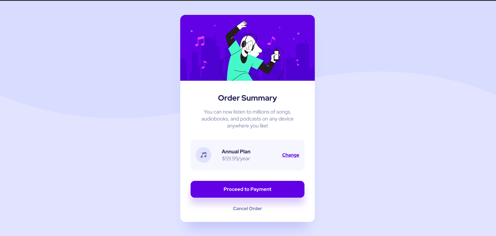

  <a href="#-tecnologias">Tecnologias</a>&nbsp;&nbsp;&nbsp;|&nbsp;&nbsp;&nbsp;
  <a href="#-projeto">Projeto</a>&nbsp;&nbsp;&nbsp;|&nbsp;&nbsp;&nbsp;
  <a href="#-layout">Layout</a>

 

 

  

## 🚀 Tecnologias

Esse projeto foi desenvolvido com as seguintes tecnologias:

- HTML
- CSS

Bibliotecas

- [Google Fonts](https://fonts.google.com/)

## 💻 Projeto

Desenvolvido pela Frontend Mentor. 
Um projeto perfeito para iniciantes que estão começando a ganhar confiança com layouts! 
O desafio é construir este componente do cartão de resumo do pedido e fazê-lo parecer o mais próximo possível do design.

➡️ &nbsp;&nbsp;[Acesso ao projeto](https://mariamorena27.github.io/order_summary_component/)

---

## 🔖 Layout

Você pode visualizar o layout do projeto através [desse link](https://www.frontendmentor.io/challenges/order-summary-component-QlPmajDUj).

---

Feito com ♥ by Maria Morena!
